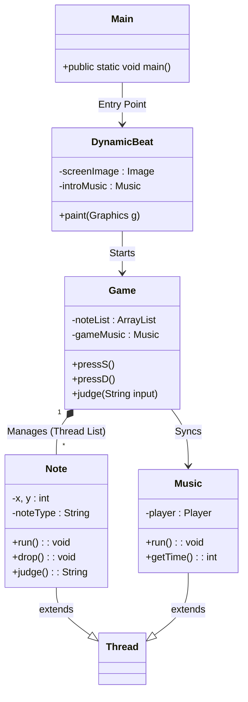

# 🎵 Dynamic Beat - Java Thread & Algorithm Challenge

<div align="center">


**프로젝트 유형:** 개인 토이 프로젝트 (CS 이론 실습)

**개발 기간:** 2023.10 ~ 2023.12 (1인 개발)

**핵심 키워드:** Multi-threading, Algorithm, Double Buffering

</div>

---

## 📑 목차
- [프로젝트 소개](#-프로젝트-소개)
- [기술 스택](#-기술-스택)
- [시스템 아키텍처](#-시스템-아키텍처-uml)
- [핵심 기술적 도전](#-핵심-기술적-도전-key-features)
- [트러블 슈팅 로그](#-트러블-슈팅-troubleshooting-log)
- [게임 시스템](#-게임-시스템)
- [프로젝트 구조](#-프로젝트-구조)
- [회고](#-회고-retrospective)

---

## 🎮 프로젝트 소개

**"CS 이론을 눈에 보이는 결과물로 만들 수 있을까?"**

컴퓨터공학의 핵심인 **프로세스와 스레드(Thread)**, 그리고 **메모리 관리**가 실제 어플리케이션에서 어떻게 작동하는지 체득하기 위해 시작했습니다.

기존의 정형화된 리듬 게임 로직을 분석한 뒤, 이를 발전시켜 '난이도 조절 알고리즘'과 '랜덤 노트 생성 로직'을 독자적으로 구현하여 게임성을 강화했습니다.

### 🎯 핵심 목표
- **Multi-threading:** 수십 개의 노트(Note) 객체와 배경음악(Music)을 동시에 제어하며 동시성 프로그래밍 학습
- **Algorithm:** 난이도에 따라 불규칙하지만 리듬감 있는 비트를 생성하는 알고리즘 설계
- **GUI Optimization:** Java Swing의 한계인 화면 깜빡임을 '더블 버퍼링' 기법으로 해결

---

## 🛠️ 기술 스택

| Category | Technology |
| :--- | :--- |
| **Language** | Java 8 (JDK 1.8) |
| **GUI Library** | Java Swing, AWT |
| **Core Concept** | Multi-threading, Double Buffering |
| **Audio** | JLayer (MP3 Decoding) |

---

## 📐 시스템 아키텍처 (UML)
> **객체 간의 상호작용과 스레드 상속 구조를 시각화했습니다.**



---

## ⭐ 핵심 기술적 도전 (Key Features)

### 1. 멀티스레드 기반 노트 시스템 (Concurrency)

각각의 노트(`Note`)를 독립적인 스레드로 구현하여, 메인 게임 루프와 상관없이 독립적인 속도와 타이밍을 가지도록 설계했습니다.

```java
public class Note extends Thread {
    @Override
    public void run() {
        while (true) {
            drop(); // 노트 하강 로직 (y좌표 증가)
            if(proceeded) {
                Thread.sleep(Main.SLEEP_TIME); // 10ms 단위 렌더링
            } else {
                interrupt(); // 판정 종료 시 스레드 자원 해제
                break;
            }
        }
    }
}

```

### 2. 더블 버퍼링 (Double Buffering) 시각화 최적화

Java Swing의 `paint()` 메소드가 호출될 때마다 화면이 깜빡이는 플리커링(Flickering) 현상을 해결하기 위해, **메모리(Back Buffer)에 이미지를 먼저 그린 후 화면에 한 번에 전송**하는 기법을 적용했습니다.

### 3. 랜덤 비트 생성 알고리즘

단순 랜덤이 아닌, 음악적 템포를 고려한 '최소/최대 간격' 제약 조건을 둔 알고리즘을 구현했습니다.

```java
// 난이도 조절 알고리즘: 이전 비트 시간 + 랜덤 간격(최소~최대)
int gap = (int)(Math.random() * (maxGap - minGap + 1) + minGap);
int startTime = beats[i-1].getTime() + gap;

```

---

## 🚒 트러블 슈팅 (Troubleshooting Log)

> **프로젝트 진행 중 발생한 주요 기술적 이슈와 해결 과정입니다. (클릭하여 상세보기)**

<details>
<summary>👉 <b>1. 수많은 노트 스레드로 인한 메모리 누수 해결</b></summary>

**[문제 상황]**

* 게임이 진행될수록 생성된 `Note` 스레드가 쌓여 JVM 힙 메모리 사용량이 급증하고 렉이 발생함.

**[해결 과정]**

* **스레드 생명주기 관리:** 판정선(Judge Line)을 지나거나 키 입력이 된 노트는 `interrupt()`를 호출하여 즉시 스레드를 종료시킴.
* **GC 유도:** `ArrayList`에서 해당 객체를 `remove()`하여 가비지 컬렉터가 수거하도록 유도.

**[결과]**

* 장시간 플레이 시에도 안정적인 메모리 점유율 유지.

</details>

<details>
<summary>👉 <b>2. 음악과 노트의 싱크 밀림 현상 (Time Drift)</b></summary>

**[문제 상황]**

* `Thread.sleep(10)`으로 루프를 돌렸으나, OS 스케줄링 오차로 인해 시간이 갈수록 음악보다 노트가 느려지는 현상 발생.

**[해결 과정]**

* **시간 동기화 (Time Sync):** 단순히 `sleep`에 의존하지 않고, `Music` 스레드에서 현재 재생 중인 음악의 타임스탬프(`getTime()`)를 실시간으로 가져옴.
* **위치 보정:** `(현재시간 - 노트생성시간) * 속도` 공식을 적용하여 노트의 Y좌표를 강제로 동기화.

**[결과]**

* 곡이 끝날 때까지 1ms 오차 범위 내에서 정확한 싱크 유지.

</details>

<details>
<summary>👉 <b>3. 화면 깜빡임 (Screen Flickering) 현상</b></summary>

**[문제 상황]**

* AWT의 `paint()` 메소드가 캔버스를 지우고 다시 그리는 과정이 눈에 보여 심한 깜빡임 발생.

**[해결 과정]**

* **더블 버퍼링 도입:** `createImage()`로 가상 이미지를 생성하고, 모든 그리기를 마친 뒤 `drawImage()`로 한 번에 출력.

**[결과]**

* 60fps 수준의 부드러운 애니메이션 구현 성공.

</details>

---

## 🎯 게임 시스템

### 조작 방법

| 키 | 노트 레인 |
| --- | --- |
| S | 1번 레인 |
| D | 2번 레인 |
| F | 3번 레인 |
| **Space** | **4~5번 레인 (롱노트)** |
| J | 6번 레인 |
| K | 7번 레인 |
| L | 8번 레인 |

### 판정 시스템 (FIFO 구조)

`ArrayList`를 Queue처럼 활용하여, 가장 먼저 생성된 노트부터 순차적으로 판정합니다.

| 판정 | 점수 | 판정 범위 |
| --- | --- | --- |
| **Perfect** | +50 | ±13ms |
| **Great** | +30 | ±14ms |
| **Good** | +20 | ±13ms |
| **Miss** | -10 | 판정선 통과 |

---

## 📂 프로젝트 구조

```bash
src/dynamic_beat_final
├── Main.java          # Entry Point & 상수는 여기 정의
├── DynamicBeat.java   # GUI Frame & Double Buffering 구현
├── Game.java          # Main Logic & Rendering Loop
├── Note.java          # Note Object (Thread 상속)
├── Music.java         # Audio Player (Thread 상속)
├── Beat.java          # Data Structure (VO)
└── KeyListener.java   # Keyboard Input Handler

```

---

## 🤔 회고 (Retrospective)

> "화려한 프레임워크 없이, **오직 Java 언어 자체의 기능(Thread, AWT)** 만으로 시스템을 구축해본 소중한 경험입니다."

이 프로젝트를 통해 **'동시성(Concurrency)'**이 얼마나 다루기 까다로운지 몸소 체험했습니다.

여러 스레드가 동시에 자원에 접근할 때 발생하는 문제와, 이를 해결하기 위한 동기화의 중요성을 배웠습니다. 이는 훗날 웹 서버의 요청 처리 방식을 이해하는 데 큰 밑거름이 되었습니다.

```
