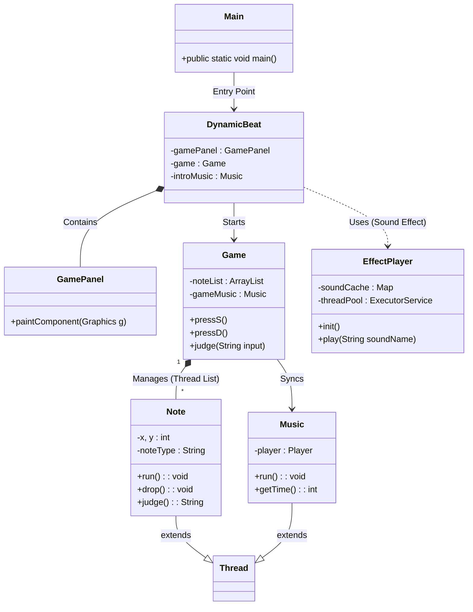

# 🎵 Dynamic Beat - Java Thread & Algorithm Challenge

<div align="center">


**프로젝트 유형:** 개인 토이 프로젝트 (CS 이론 실습 및 리팩토링)

**개발 기간:** 2023.10 ~ 2023.12 (1인 개발) / 2026.02 (리팩토링)

**핵심 키워드:** Multi-threading, Algorithm, Double Buffering, Refactoring, Design Pattern

</div>

---

## 📑 목차
- [프로젝트 소개](#-프로젝트-소개)
- [기술 스택](#-기술-스택)
- [시스템 아키텍처](#-시스템-아키텍처-uml)
- [핵심 기술적 도전](#-핵심-기술적-도전-key-features)
- [리팩토링 로그](#-리팩토링-로그-refactoring-log)
- [트러블 슈팅 로그](#-트러블-슈팅-troubleshooting-log)
- [게임 시스템](#-게임-시스템)
- [프로젝트 구조](#-프로젝트-구조)
- [회고](#-회고-retrospective)

---

## 🎮 프로젝트 소개

**"CS 이론을 눈에 보이는 결과물로 만들 수 있을까?"**

컴퓨터공학의 핵심인 **프로세스와 스레드(Thread)**, 그리고 **메모리 관리**가 실제 어플리케이션에서 어떻게 작동하는지 체득하기 위해 시작했습니다.

기존의 정형화된 리듬 게임 로직을 분석한 뒤, 이를 발전시켜 '난이도 조절 알고리즘'과 '랜덤 노트 생성 로직'을 독자적으로 구현하여 게임성을 강화했습니다.

최근에는 **레거시 코드(Legacy Code) 개선**을 목표로 대규모 리팩토링을 진행하여, 유지보수성과 확장성을 고려한 현대적인 아키텍처로 탈바꿈했습니다.

### 🎯 핵심 목표
- **Multi-threading:** 수십 개의 노트(Note) 객체와 배경음악(Music)을 동시에 제어하며 동시성 프로그래밍 학습
- **Algorithm:** 난이도에 따라 불규칙하지만 리듬감 있는 비트를 생성하는 알고리즘 설계
- **Refactoring:** `static` 변수 제거, 의존성 주입(DI), 디자인 패턴 적용을 통한 코드 품질 개선
- **Performance:** 스레드 풀(Thread Pool)과 캐싱(Caching)을 활용한 반응 속도 최적화

---

## 🛠️ 기술 스택

| Category | Technology |
| :--- | :--- |
| **Language** | Java 17 (Migrated from Java 8) |
| **GUI Library** | Java Swing, AWT |
| **Build Tool** | Gradle |
| **Core Concept** | Multi-threading, Double Buffering, Thread Pool |
| **Audio** | JLayer (MP3 Decoding) |

---

## 📐 시스템 아키텍처 (UML)
> **객체 간의 상호작용과 스레드 상속 구조를 시각화했습니다.**



---

## ⭐ 핵심 기술적 도전 (Key Features)

### 1. 멀티스레드 기반 노트 시스템 (Concurrency)

각각의 노트(`Note`)를 독립적인 스레드로 구현하여, 메인 게임 루프와 상관없이 독립적인 속도와 타이밍을 가지도록 설계했습니다.

```java
public class Note extends Thread {
    @Override
    public void run() {
        while (true) {
            drop(); // 노트 하강 로직 (y좌표 증가)
            if(proceeded) {
                Thread.sleep(Main.SLEEP_TIME); // 10ms 단위 렌더링
            } else {
                interrupt(); // 판정 종료 시 스레드 자원 해제
                break;
            }
        }
    }
}
```

### 2. 더블 버퍼링 (Double Buffering) 시각화 최적화

Java Swing의 `paint()` 메소드가 호출될 때마다 화면이 깜빡이는 플리커링(Flickering) 현상을 해결하기 위해, **메모리(Back Buffer)에 이미지를 먼저 그린 후 화면에 한 번에 전송**하는 기법을 적용했습니다. (리팩토링 후 `JPanel`의 `paintComponent` 활용 방식으로 개선)

### 3. 사운드 캐싱 및 스레드 풀 (Performance Optimization)

버튼 클릭 시마다 발생하는 사운드 로딩 지연(Latency)을 해결하기 위해 **캐싱(Caching)** 과 **스레드 풀(Thread Pool)** 을 도입했습니다.

```java
// EffectPlayer.java
private static Map<String, byte[]> soundCache = new HashMap<>();
private static final ExecutorService threadPool = Executors.newCachedThreadPool();

public static void play(String soundName) {
    // 메모리에서 즉시 로드 후 스레드 풀에서 재생
    byte[] audioData = soundCache.get(soundName);
    threadPool.execute(() -> { ... });
}
```

---

## 🔨 리팩토링 로그 (Refactoring Log)

> **2026.02 대규모 리팩토링 진행 내용입니다.**

### 1. 프로젝트 구조 표준화
* **Before:** 이클립스 기반의 비표준 디렉토리 구조 (`src/dynamic_beat_final`, 프로젝트 루트에 리소스 혼재)
* **After:** Gradle 기반의 표준 구조 (`src/main/java`, `src/main/resources`)로 변경하여 빌드 및 의존성 관리 효율화.

### 2. 객체 지향적 구조 개선 (OOP)
* **Before:** `static` 변수(`DynamicBeat.game`)를 남용하여 강한 결합도(Tight Coupling) 발생.
* **After:** `static` 제거 및 의존성 주입(DI) 패턴 적용. `KeyListener`를 내부 클래스로 캡슐화하여 정보 은닉 강화.

### 3. GUI 렌더링 방식 개선
* **Before:** `JFrame`의 `paint()`를 직접 오버라이드하고 수동으로 더블 버퍼링 구현 (최신 OS 호환성 문제).
* **After:** `JPanel`의 `paintComponent()`를 오버라이드하고 Swing의 내장 더블 버퍼링 기능을 활용하여 안정성 확보.

### 4. 반응성(Responsiveness) 개선
* **Before:** `Thread.sleep()`을 사용하여 UI 스레드(EDT)를 차단, 버튼 클릭 시 멈춤 현상 발생.
* **After:** `javax.swing.Timer`를 도입하여 비동기적으로 지연 작업을 처리, UI 반응성 극대화.

---

## 🚒 트러블 슈팅 (Troubleshooting Log)

<details>
<summary>👉 <b>1. 수많은 노트 스레드로 인한 메모리 누수 해결</b></summary>

**[문제 상황]**
* 게임이 진행될수록 생성된 `Note` 스레드가 쌓여 JVM 힙 메모리 사용량이 급증하고 렉이 발생함.

**[해결 과정]**
* **스레드 생명주기 관리:** 판정선(Judge Line)을 지나거나 키 입력이 된 노트는 `interrupt()`를 호출하여 즉시 스레드를 종료시킴.
* **GC 유도:** `ArrayList`에서 해당 객체를 `remove()`하여 가비지 컬렉터가 수거하도록 유도.

**[결과]**
* 장시간 플레이 시에도 안정적인 메모리 점유율 유지.
</details>

<details>
<summary>👉 <b>2. 사운드 재생 딜레이 (Audio Latency)</b></summary>

**[문제 상황]**
* 버튼 클릭 시 `new Music()`으로 매번 파일을 로드하여 미세한 딜레이 발생.

**[해결 과정]**
* **캐싱(Caching):** 자주 쓰는 효과음을 `byte[]` 형태로 메모리에 미리 로드.
* **스레드 풀:** `ExecutorService`를 사용하여 스레드 생성 비용 절감.

**[결과]**
* 버튼 반응 속도 대폭 개선.
</details>

---

## 🎯 게임 시스템

### 조작 방법

| 키 | 노트 레인 |
| --- | --- |
| S | 1번 레인 |
| D | 2번 레인 |
| F | 3번 레인 |
| **Space** | **4~5번 레인 (롱노트)** |
| J | 6번 레인 |
| K | 7번 레인 |
| L | 8번 레인 |

### 판정 시스템 (FIFO 구조)

`ArrayList`를 Queue처럼 활용하여, 가장 먼저 생성된 노트부터 순차적으로 판정합니다.

| 판정 | 점수 | 판정 범위 |
| --- | --- | --- |
| **Perfect** | +50 | ±13ms |
| **Great** | +30 | ±14ms |
| **Good** | +20 | ±13ms |
| **Miss** | -10 | 판정선 통과 |

---

## 📂 프로젝트 구조

```bash
src/main
├── java/dynamic_beat_final
│   ├── Main.java          # Entry Point & 상수는 여기 정의
│   ├── DynamicBeat.java   # GUI Frame & GamePanel (View)
│   ├── Game.java          # Main Logic & Rendering Loop (Controller)
│   ├── Note.java          # Note Object (Thread 상속)
│   ├── Music.java         # BGM Player
│   ├── EffectPlayer.java  # Sound Effect Manager (Caching)
│   ├── Beat.java          # Data Structure (VO)
│   └── ScoreResult.java   # Result Screen
└── resources
    ├── images             # Game Assets (Images)
    └── music              # Game Assets (Audio)
```

---

## 🤔 회고 (Retrospective)

> "화려한 프레임워크 없이, **오직 Java 언어 자체의 기능(Thread, AWT)** 만으로 시스템을 구축해본 소중한 경험입니다."

이 프로젝트를 통해 **'동시성(Concurrency)'** 이 얼마나 다루기 까다로운지 몸소 체험했습니다.

초기에는 단순히 기능 구현에 급급했지만, 리팩토링 과정을 통해 **'유지보수 가능한 코드'** 와 **'객체 지향적 설계'** 의 중요성을 깊이 깨달았습니다. 특히 `static` 변수의 의존성을 끊어내고, 스레드 풀을 도입하여 성능을 개선하는 과정은 실제 현업에서의 최적화 경험과 맞닿아 있다고 생각합니다.
