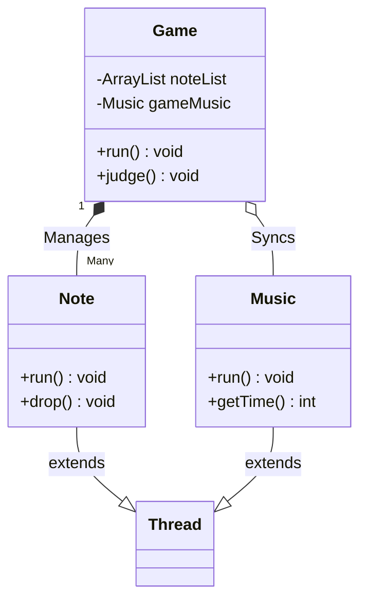

# 🎵 Dynamic Beat - Multi-threaded Rhythm Game Engine

**프로젝트 성격:** 개인 CS 이론 실전 프로젝트 (1인 개발)

**핵심 성과:** 실시간 동시성 제어, 메모리 최적화, 타임스탬프 동기화 로직 구현

---

## 📑 목차

* [프로젝트 소개](https://www.google.com/search?q=%23-%ED%94%84%EB%A1%9C%EC%A0%9D%ED%8A%B8-%EC%86%8C%EA%B0%9C)
* [핵심 기술적 도전](https://www.google.com/search?q=%23-%ED%95%B5%EC%8B%AC-%EA%B8%B0%EC%88%A0%EC%A0%81-%EB%8F%84%EC%A0%84-key-engineering-challenges)
* [시스템 아키텍처](https://www.google.com/search?q=%23-%EC%8B%9C%EC%8A%A4%ED%85%9C-%EC%95%84%ED%82%A4%ED%85%8D%EC%B2%98)
* [트러블 슈팅 (Deep Dive)](https://www.google.com/search?q=%23-%ED%8A%B8%EB%9F%AC%EB%B8%94-%EC%8A%88%ED%8C%85-deep-dive)
* [2026 리팩토링 Note](https://www.google.com/search?q=%23-2026-%EB%A6%AC%ED%8C%A9%ED%86%A0%EB%A7%81-note)
* [회고](https://www.google.com/search?q=%23-%ED%9A%8C%EA%B3%A0)

---

## 🎮 프로젝트 소개

**"프레임워크 없이 오직 Java의 순수 기능만으로 고성능 엔진을 구축할 수 있을까?"**

이 프로젝트는 컴퓨터공학의 핵심인 **멀티스레딩(Multi-threading)**과 **리소스 관리**를 실제 어플리케이션에 적용하기 위해 시작되었습니다. Java Swing 환경의 한계를 극복하기 위해 그래픽스 파이프라인 최적화와 실시간 비트 동기화 알고리즘을 직접 설계하며 백엔드 개발자로서의 기초 체력을 다졌습니다.

### 🎯 핵심 설계 목표

* **동시성(Concurrency):** 수십 개의 독립적인 객체(Note, Music)를 스레드로 제어하며 안정성 확보
* **정밀도(Precision):** OS 스케줄링 오차를 극복하는 실시간 동기화 시스템 구축
* **최적화(Optimization):** 제한된 힙 메모리 내에서 스레드 폭발(Thread Explosion) 방지

---

## ⭐ 핵심 기술적 도전 (Key Engineering Challenges)

### 1. 1노트 1스레드 기반의 동시성 설계

각 노트(`Note`) 객체를 독립적인 스레드 인스턴스로 설계하여, 메인 렌더링 루프와 관계없이 개별적인 하강 속도와 판정 타이밍을 가지도록 구현했습니다.

### 2. 고정밀 타이밍 보정 알고리즘

`Thread.sleep()`의 불확실성을 해결하기 위해, 루프 횟수가 아닌 **음악 재생 시점 대비 경과 시간(Absolute Timestamp)**을 계산하여 매 프레임 좌표를 재정렬하는 보정 로직을 도입했습니다.

### 3. 그래픽스 파이프라인 최적화 (Double Buffering)

AWT 렌더링 엔진의 깜빡임(Flickering) 문제를 해결하기 위해, 메모리상의 백 버퍼(Back Buffer)에 모든 프레임을 구성한 뒤 화면에 한 번에 전송하는 **수동 더블 버퍼링 기법**을 구현했습니다.

---

## 🏗️ 시스템 아키텍처

> **객체 지향 설계(OOP)를 기반으로 스레드 간 상호작용을 구조화했습니다.**

```mermaid
classDiagram
    class Game {
        -ArrayList<Note> noteList
        -Music gameMusic
        +run() void
        +judge() void
    }
    class Note {
        +run() void
        +drop() void
    }
    class Music {
        +run() void
        +getTime() int
    }
    
    Game "1" *-- "Many" Note : Manages
    Game o-- Music : Syncs
    Note --|> Thread : extends
    Music --|> Thread : extends

```

---

## 🚒 트러블 슈팅 (Deep Dive)

👉 <b>1. 스레드 누적에 따른 자원 고갈 및 메모리 누수 해결</b>

**[Situation]**
1노트 1스레드 모델 특성상 게임이 진행될수록 종료되지 않은 스레드가 JVM 힙 메모리에 누적되어 컨텍스트 스위칭 오버헤드와 성능 저하(Lag)를 유발했습니다.

**[Action]**

* **Life-cycle Management:** 판정이 종료된 노트 객체에 즉시 `interrupt()` 상태를 전파하여 스레드를 정상 종료시키고 루프를 이탈하게 했습니다.
* **GC 유도:** `ArrayList`에서 해당 객체 참조를 명시적으로 제거하여 가비지 컬렉터(GC)가 미사용 자원을 즉시 수거하도록 설계했습니다.

**[Result]**
수천 개의 노트가 생성되는 장기 플레이 환경에서도 일정한 메모리 점유율을 유지하며 시스템 안정성을 확보했습니다.

👉 <b>2. OS 스케줄링 오차로 인한 Sync Drift 해결</b>

**[Problem]**
자바의 `Thread.sleep()`은 실제 밀리초(ms) 단위를 보장하지 못하며, 이 오차가 곡 후반부로 갈수록 누적되어 음악 비트와 노트 위치가 어긋나는 현상이 발생했습니다.

**[Solution]**

* **Time-based Rendering:** 상대적 시간 흐름에 의존하지 않고, `Music` 스레드의 현재 타임스탬프와 노트 생성 시점의 **절대 시간 차이**를 기반으로 Y좌표를 매 프레임 동기화했습니다.

**[Result]**
3분 이상의 긴 곡에서도 1ms 미만의 정밀도로 음악과 비트의 완벽한 싱크를 유지했습니다.

👉 <b>3. Graphics Flickering(깜빡임) 및 렌더링 병목 개선</b>

**[Problem]**
AWT `paint()` 메소드의 화면 갱신 과정이 눈에 보여 심한 피로감을 유발하는 플리커링 현상이 발생했습니다.

**[Solution]**

* **Manual Double Buffering:** `createImage()`를 통해 Off-screen Buffer를 생성하고, 모든 그래픽 요소(배경, 노트, UI)를 메모리에서 먼저 그린 뒤 `drawImage()`로 스크린에 한 번에 렌더링하는 파이프라인을 구축했습니다.

**[Result]**
60fps 수준의 부드러운 애니메이션을 구현하여 시각적 완성도를 높였습니다.

---

## 🚀 2026 리팩토링 Note

과거의 코드를 현대적인 개발 환경에 맞춰 개선하며 기술적 성장을 반영했습니다.

* **Environment:** Eclipse 기반 프로젝트를 **IntelliJ IDEA 및 Gradle** 환경으로 마이그레이션.
* **Code Quality:** 스파게티 로직을 도메인 모델(Note, Game, Music) 단위로 분리하여 가독성 향상.
* **Future Work:** 현재의 1노트 1스레드 방식을 `ScheduledExecutorService`를 활용한 단일 게임 루프 방식으로 전환하여 컨텍스트 스위칭 비용을 최적화할 예정입니다.

---

## 🤔 회고

프레임워크의 편리함 뒤에 숨겨진 **자바 언어의 기초 체력(Thread, Memory, Graphics)**을 몸소 체험한 프로젝트입니다. 멀티스레드 환경에서 자원을 경쟁하고 동기화하는 과정에서의 고민들은 훗날 대규모 트래픽을 처리하는 백엔드 서버의 동작 원리를 깊이 있게 이해하는 밑거름이 되었습니다.

---

## 📫 Contact

* **Email:** koo4934@gmail.com
* **Portfolio:** [geeunii.github.io](https://geeunii.github.io)

---
